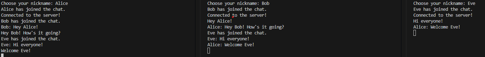

# 🗨️ TCP Chat Application

A simple multi-client chat system built with Python using **TCP socket programming** and **multi-threading**.

This project demonstrates core networking concepts, such as TCP/IP communication, port binding, and concurrent client handling — ideal for learning systems fundamentals or distributed communication.

---

## 🚀 Features

- ✅ Real-time message broadcasting to all connected clients
- ✅ Supports multiple clients simultaneously using threads
- ✅ Nickname registration on join
- ✅ Run locally or across devices on the same network (LAN)

---

## 🛠 How to Run

### 1. Clone the Repository
```bash
git clone https://github.com/yourusername/tcp-chat-app.git
cd tcp-chat-app
```

### 2. Run the Server
```bash
python server.py
```

### 3. Run One or More Clients (each in a separate terminal)
```bash
python client.py
```

You'll be prompted to enter a nickname for each client.

---

## 🎥 Demo

This example shows three clients chatting:

- Alice joins first
- Bob says hello
- Eve joins the conversation
- Bob disconnects

 


 


## 📚 Tech Stack

- **Python 3**
- **socket** – for TCP communication
- **threading** – for handling multiple clients concurrently

---

## 📋 What I Learned

- Network programming with TCP sockets
- Multi-threaded server architecture
- Client-server communication protocols
- Handling concurrent connections and message broadcasting

## 💡 Future Improvements

- GUI interface with Tkinter
- Message history logging
- Encryption support
- WebSocket version with Flask or FastAPI